# Space Multi Design PPT

> 品牌设计风格驱动的 AI 幻灯片生成 Skill —— 把任意内容变成带顶级品牌设计语言的 Slide。

结合 [brand-design-md](https://github.com/SpaceZephyr/brand-design-md)（62 个真实品牌设计规范）与 [design-buddy/space-slide-deck](https://github.com/SpaceZephyr/design-buddy/tree/main/space-slide-deck)（幻灯片生成流程）。核心理念：**不靠凭空发挥的"好看"**——通过 [getdesign.md](https://getdesign.md) 拉取 Apple、Notion、Claude、Stripe、Linear、Tesla 等品牌的精确设计 token（颜色、字体、字距、圆角、阴影的具体数值），用真实规范驱动幻灯片渲染。

## 它是怎么工作的

```
你发内容 ──► 内容分析 ──► 风格决策 ──► 拉取品牌 DESIGN.md ──► 逐页生成 HTML ──► deck.html（可导出 PPTX/PDF）
                              │
             ┌────────────────┴────────────────┐
             │ 你指定了风格（"用 Stripe 风格"）  │ 直接生成
             │ 你没指定风格                     │ 推荐 5 个匹配品牌（各一句话介绍）
             │                                 │ + 第 6 项「智能匹配」由 AI 选定并说明理由
             └─────────────────────────────────┘
```

**5+1 推荐示例**（发一份咖啡连锁 BP 后，Skill 的实际回复）：

> 1. **Stripe** — 紫色渐变 + 300 字重优雅排版，投资人看惯的金融科技质感
> 2. **Claude** — 奶油暖底 + 赭石强调色，和咖啡品牌的暖调天然契合
> 3. **Airbnb** — 珊瑚暖色 + 圆润 UI，适合讲社区与复购故事
> 4. **Shopify** — 深色电影感 + 荧光绿，创业增长叙事的现代锋利感
> 5. **Apple** — 极致留白，让 62% 毛利这些数字自己说话
> 6. **智能匹配** — 我根据内容气质直接选择最合适的风格（含混搭）

## 案例展示

两个案例均为本 Skill 实测产出（克隆仓库后用浏览器打开 `deck.html`，←/→ 翻页、F 全屏、G 网格总览）：

| [FlowPilot 产品介绍](examples/flowpilot-notion/) | [橙洲咖啡投资人路演](examples/chengzhou-coffee-claude/) |
|---|---|
| 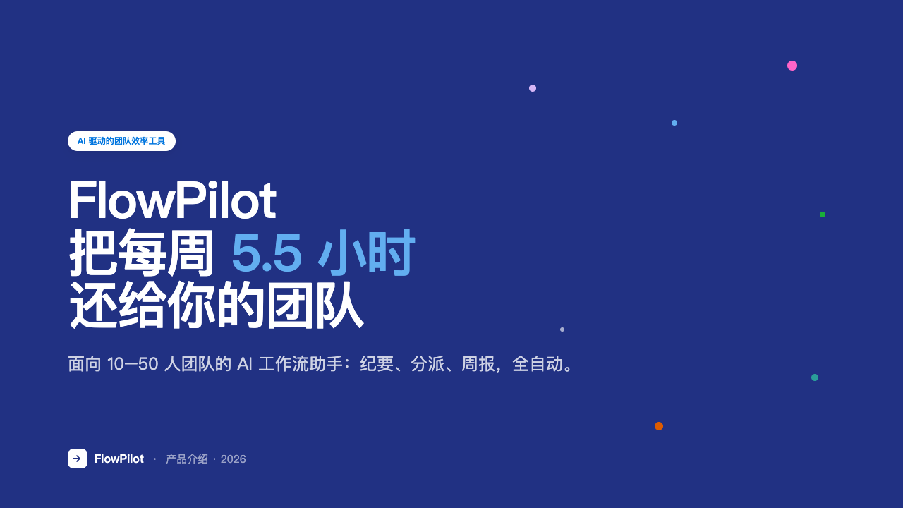 | 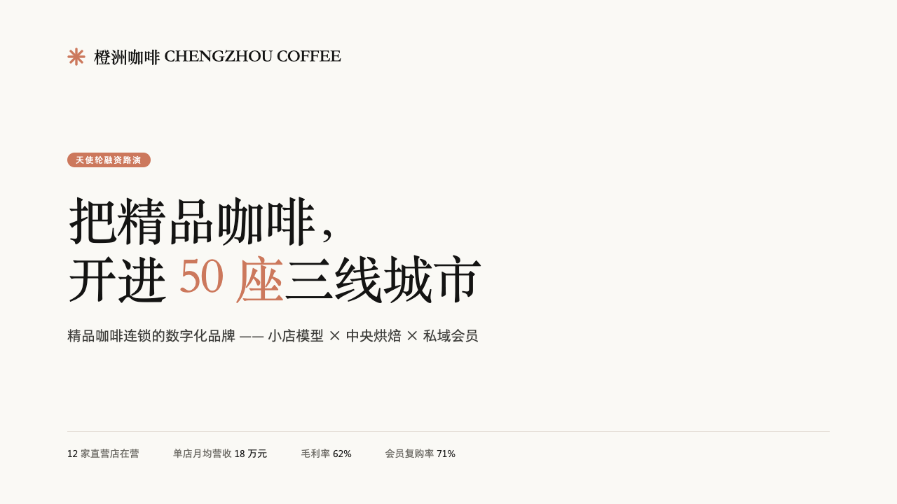 |
| 一段 AI 效率工具文字介绍，用户指定 **Notion** 风格后直接生成。8 页，使用真实 Notion token：画布 `#f6f5f4`、文字 `rgba(0,0,0,0.95)`、标题字距 `-2.125px`。 | 一段咖啡连锁 BP，未指定风格 → 5+1 推荐 → 用户选智能匹配 → AI 选定 **Claude**（理由见 [style-recommendation.md](examples/chengzhou-coffee-claude/style-recommendation.md)）。8 页，coral `#cc785c` + 奶油画布 `#faf9f5` + 衬线编辑排版。 |

每个案例目录还包含中间产物：`outline.md`（大纲）、`design-tokens.md`（从 DESIGN.md 提取的 token 记录）、`slides/`（每页独立的 1280×720 HTML）。

### 多风格案例图

同一段介绍本 Skill 的文案，分别套用不同品牌设计语言。重点看风格差异：画布、字体、强调色、组件形态和视觉节奏都会跟着品牌系统变化。

| Apple | Claude | Notion |
|---|---|---|
| 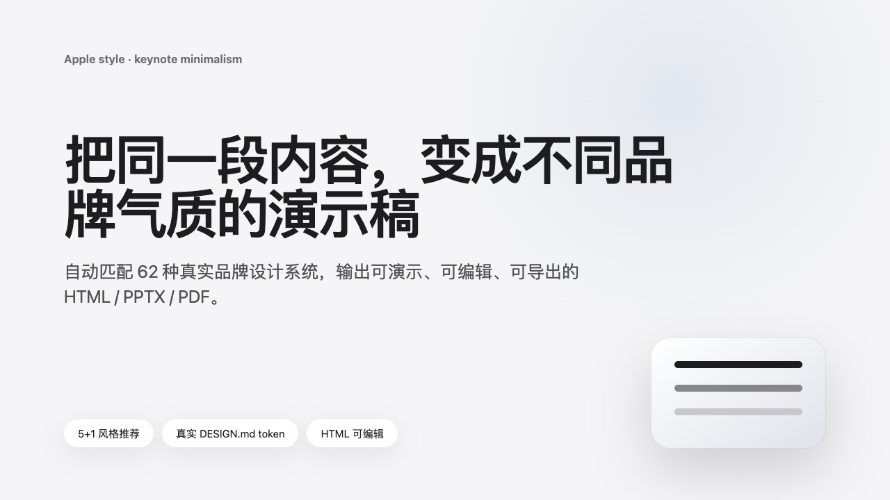 | 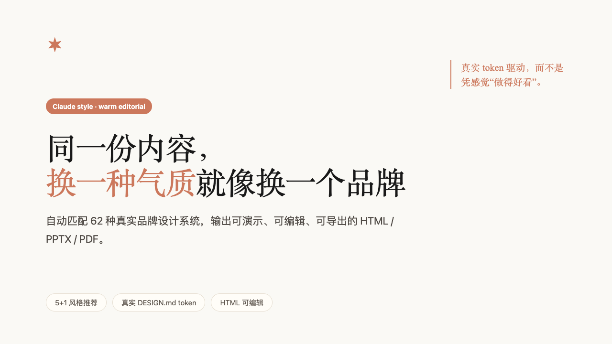 | 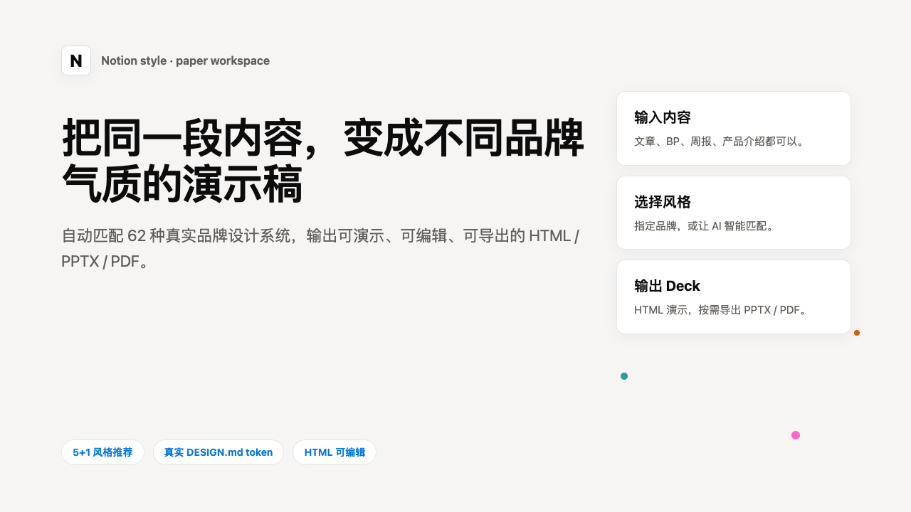 |
| 极致留白 + 产品发布会质感 | 暖调编辑排版 + 智识感 | 纸感工作区 + 柔和卡片 |

| Stripe | Linear | Tesla |
|---|---|---|
| 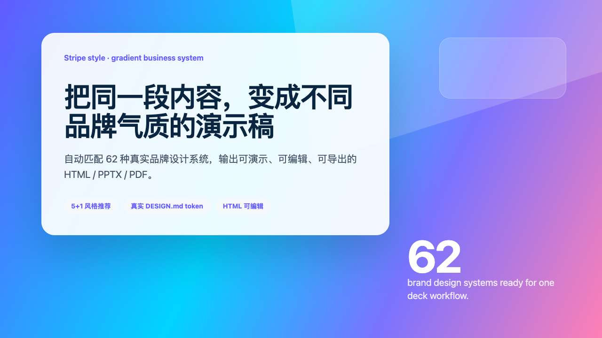 | 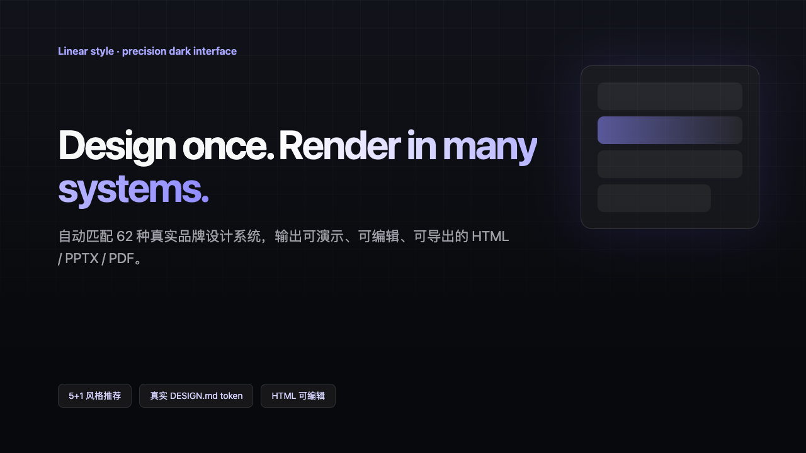 | 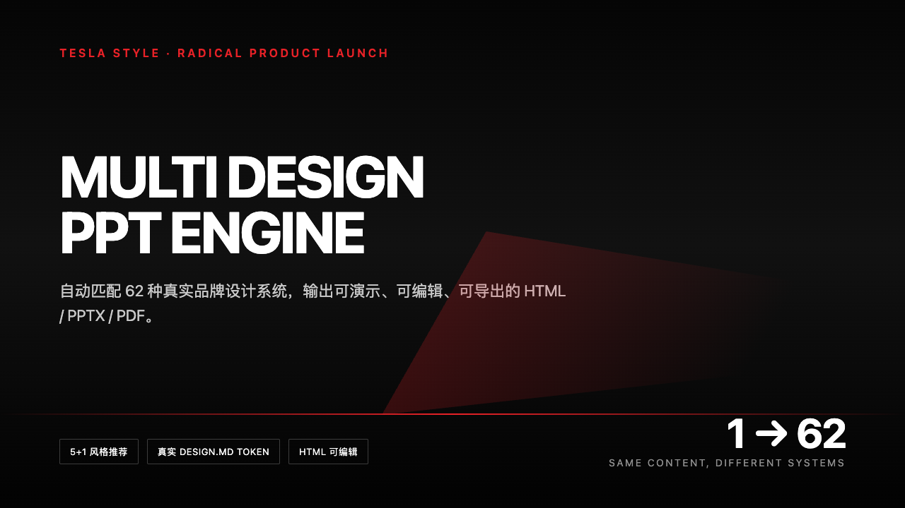 |
| 紫蓝渐变 + 商业系统感 | 深色网格 + 精准效率工具 | 黑红减法 + 未来发布会 |

| Vercel | Figma | NVIDIA |
|---|---|---|
| 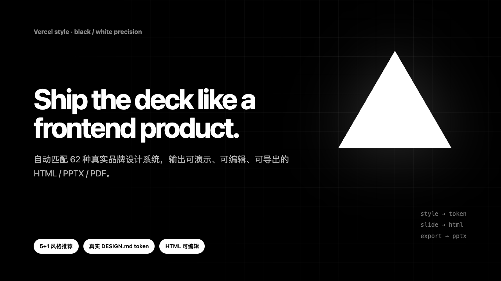 | 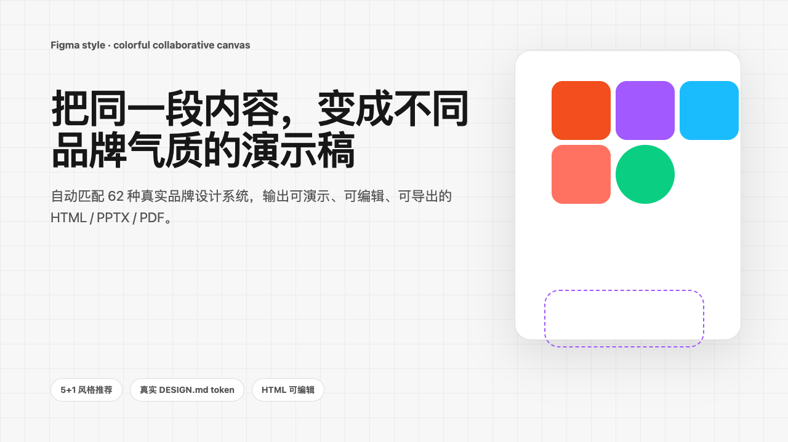 | 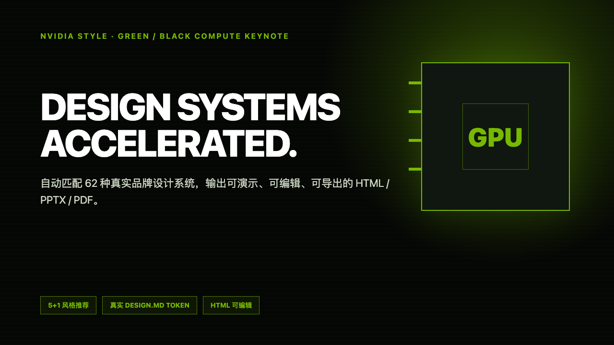 |
| 黑白精准 + 开发者极简 | 多彩节点 + 协作画布 | 绿黑高对比 + 算力发布会 |

| Airbnb | Spotify | Miro |
|---|---|---|
| 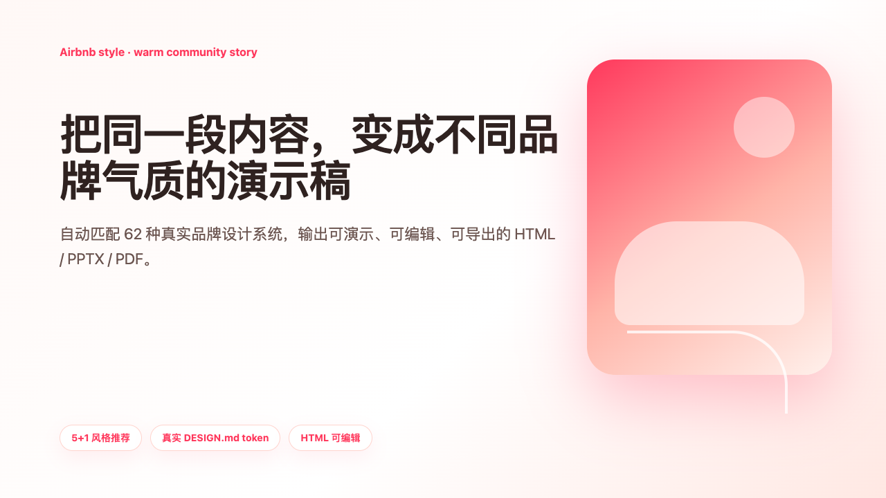 | 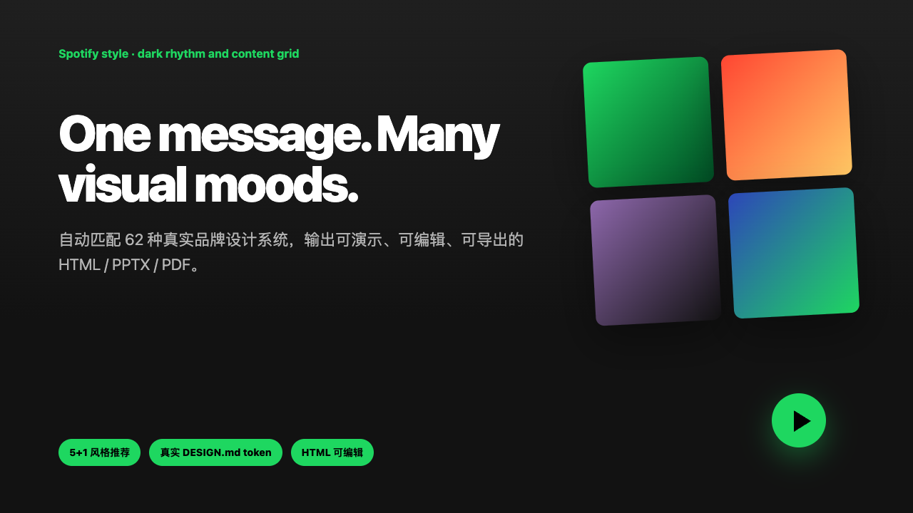 | 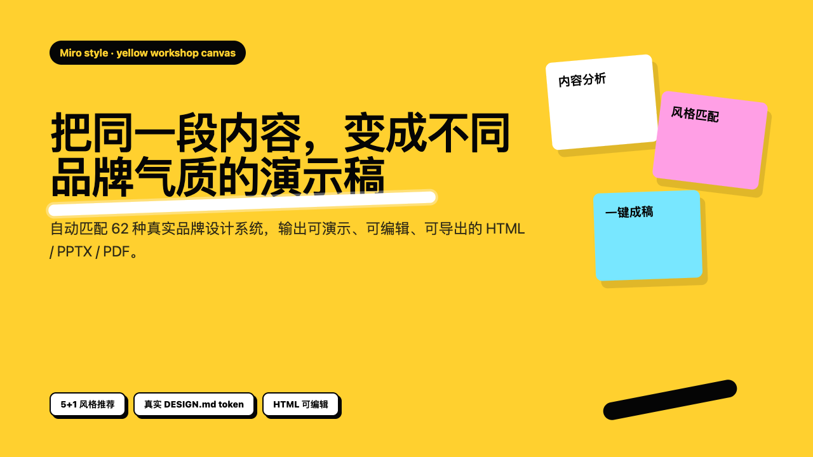 |
| 珊瑚暖色 + 生活方式叙事 | 深色律动 + 内容网格 | 明黄白板 + 便签工作坊 |

## 安装

**Claude Code**：把本仓库克隆到 skills 目录

```bash
git clone https://github.com/SpaceZephyr/space-multi-design-ppt.git ~/.codex/skills/space-multi-design-ppt
```

**Claude Cowork / Claude.ai**：把仓库打包上传为 Skill（Settings → Capabilities → Skills）。

依赖：Node.js（`npx getdesign` 拉取设计规范）；导出 PPTX/PDF 需 `pip install playwright python-pptx && python -m playwright install chromium`（不导出则无需）。

## 使用

```
把这篇文章做成 PPT                        # → 触发 5+1 风格推荐
用 Linear 风格把这份周报做成 slide         # → 指定风格直接生成
做一个 Tesla 风格的产品发布 deck，导出 pptx # → 生成 + 导出
Notion 配色 + Linear 排版，做个路演 PPT    # → 混搭风格
```

## 支持的 62 个品牌风格

Apple · Claude · Cursor · ElevenLabs · Figma · Framer · Lovable · Meta · MiniMax · Mintlify · Mistral · Notion · Ollama · OpenCode · PostHog · Raycast · Replicate · Resend · Runway · Sanity · Sentry · Supabase · Superhuman · Together AI · Vercel · VoltAgent · Warp · Webflow · X.AI · Zapier · Airtable · Cal.com · Clay · ClickHouse · Cohere · Composio · Expo · HashiCorp · IBM · Intercom · Linear · Miro · MongoDB · NVIDIA · Pinterest · Stripe · Binance · Coinbase · Kraken · Revolut · Wise · Airbnb · BMW · Ferrari · Lamborghini · Nike · Renault · Shopify · SpaceX · Spotify · Tesla · Uber

每个品牌的一句话风格与内容匹配标签见 [references/brand-registry.md](references/brand-registry.md)。

## 仓库结构

```
├── SKILL.md                      # Skill 主流程（8 步工作流）
├── references/
│   ├── brand-registry.md         # 62 品牌注册表：slug、风格描述、匹配标签、信号速查
│   ├── slide-html-guide.md       # 1280×720 HTML 幻灯片制作规范与布局模板
│   ├── outline-guide.md          # 内容分析、大纲格式、文案规则
│   └── image-mode.md             # 可选 AI 图像模式（需 LabNana API key）
├── scripts/
│   ├── build_deck.py             # slides/*.html → 单文件 deck.html（翻页/全屏/总览）
│   ├── export_deck.py            # HTML → PNG →  PPTX / PDF
│   └── generate_slide.py         # 图像模式生成器（来自 space-slide-deck）
├── evals/evals.json              # 测试用例（实测：断言通过率 100% vs 无 skill 基线 20%）
└── examples/                     # 实测案例与多风格图片画廊
```

## 质量基准

用 2 个真实场景测试（与无 skill 的 Claude 基线对比）：

| 指标 | 带 Skill | 无 Skill |
|---|---|---|
| 断言通过率（真实品牌 token / 推荐流程 / 叙事标题 / 数据准确） | **100%** | 20% |
| 典型差异 | 拉取真实 DESIGN.md，精确到 `-2.125px` 字距 | 凭记忆猜色值，标签式标题，无风格推荐 |

## 致谢

- [SpaceZephyr/brand-design-md](https://github.com/SpaceZephyr/brand-design-md) — 品牌设计规范获取
- [SpaceZephyr/design-buddy](https://github.com/SpaceZephyr/design-buddy) — space-slide-deck 幻灯片流程
- [getdesign.md](https://getdesign.md) — 品牌 DESIGN.md 数据源
